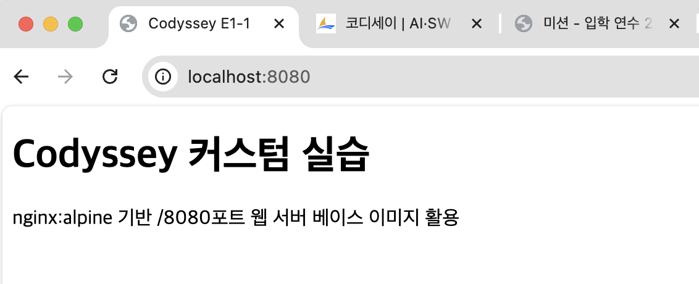
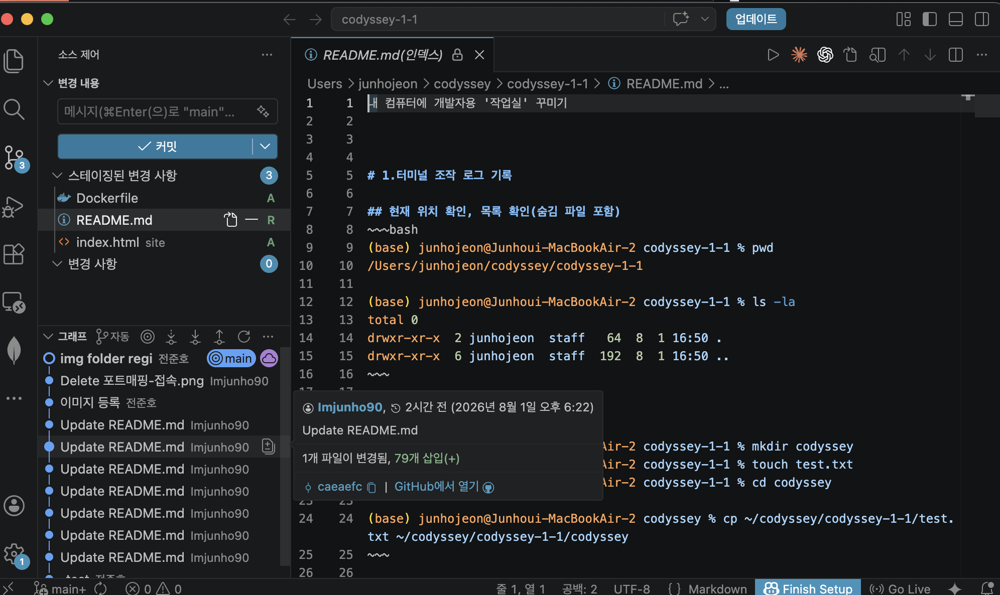

# 내 컴퓨터에 개발자용 '작업실' 꾸미기

## 1. 프로젝트 개요
이번 프로젝트에서 터미널 조작 로그 기록, 권한 실습 및 증거 기록, Docker 설치, 기본 운영 명령 수행, 컨테이너 실행, 커스텀 이미지 제작, 포트 매핑, 볼륨 영속성,바인딩 마운트 git/github 연동을 실습합니다.


## 2. 실행 환경
- OS: macOS 14.4.1 
- Shell: zsh
- Docker: 29.4
- Git: 2.39.3
- Python: 3.11.14
  
## 3. 수행 체크리스트
- [o] 터미널 기본 조작 및 폴더 구성
- [o] 권한 변경 실습
- [o] Docker 설치/점검
- [o] hello-world 실행
- [o] Dockerfile 빌드/실행
- [o] 포트 매핑 접속(2회)
- [o] 바인드 마운트 반영
- [o] 볼륨 영속성
- [o] Git 설정 + VSCode GitHub 연동


## 4. 터미널 조작 로그 기록

### 현재 위치 확인, 목록 확인(숨김 파일 포함)
~~~bash
(base) junhojeon@Junhoui-MacBookAir-2 codyssey-1-1 % pwd
/Users/junhojeon/codyssey/codyssey-1-1

(base) junhojeon@Junhoui-MacBookAir-2 codyssey-1-1 % ls -la
total 0
drwxr-xr-x  2 junhojeon  staff   64  8  1 16:50 .
drwxr-xr-x  6 junhojeon  staff  192  8  1 16:50 ..
~~~

### 이동, 생성, 복사
~~~bash
(base) junhojeon@Junhoui-MacBookAir-2 codyssey-1-1 % mkdir codyssey
(base) junhojeon@Junhoui-MacBookAir-2 codyssey-1-1 % touch test.txt
(base) junhojeon@Junhoui-MacBookAir-2 codyssey-1-1 % cd codyssey

(base) junhojeon@Junhoui-MacBookAir-2 codyssey % cp ~/codyssey/codyssey-1-1/test.txt ~/codyssey/codyssey-1-1/codyssey
~~~

### 이동/이름변경, 삭제
~~~bash
(base) junhojeon@Junhoui-MacBookAir-2 codyssey % cd codyssey-1-1
(base) junhojeon@Junhoui-MacBookAir-2 codyssey-1-1 % mv test.txt codyssey/test_1.txt
(base) junhojeon@Junhoui-MacBookAir-2 codyssey-1-1 % cd codyssey
(base) junhojeon@Junhoui-MacBookAir-2 codyssey % ls
test.txt	test_1.txt

(base) junhojeon@Junhoui-MacBookAir-2 codyssey % rm test.txt test_1.txt
(base) junhojeon@Junhoui-MacBookAir-2 codyssey % ls
(base) junhojeon@Junhoui-MacBookAir-2 codyssey % 
~~~

## 5. 권한 실습

### 파일 권한 확인 및 변경
~~~bash
(base) junhojeon@Junhoui-MacBookAir-2 codyssey-1-1 % touch test.txt
(base) junhojeon@Junhoui-MacBookAir-2 codyssey-1-1 % echo 'hello codyssey' > test.txt
(base) junhojeon@Junhoui-MacBookAir-2 codyssey-1-1 % cat test.txt
hello codyssey
(base) junhojeon@Junhoui-MacBookAir-2 codyssey-1-1 % chmod 000 test.txt
(base) junhojeon@Junhoui-MacBookAir-2 codyssey-1-1 % ls -l test.txt
----------  1 junhojeon  staff  15  8  1 17:19 test.txt
(base) junhojeon@Junhoui-MacBookAir-2 codyssey-1-1 % cat test.txt
cat: test.txt: Permission denied

(base) junhojeon@Junhoui-MacBookAir-2 codyssey-1-1 % chmod 700 test.txt
(base) junhojeon@Junhoui-MacBookAir-2 codyssey-1-1 % ls -l test.txt
-rwx------  1 junhojeon  staff  15  8  1 17:19 test.txt
(base) junhojeon@Junhoui-MacBookAir-2 codyssey-1-1 % cat test.txt
hello codyssey
~~~

~~~bash
(base) junhojeon@Junhoui-MacBookAir-2 codyssey-1-1 % mkdir test
(base) junhojeon@Junhoui-MacBookAir-2 codyssey-1-1 % ls -ld test
drwxr-xr-x  2 junhojeon  staff  64  8  1 17:24 test
(base) junhojeon@Junhoui-MacBookAir-2 codyssey-1-1 % cd test
(base) junhojeon@Junhoui-MacBookAir-2 test % cd -
~/codyssey/codyssey-1-1
(base) junhojeon@Junhoui-MacBookAir-2 codyssey-1-1 % chmod 000 test
(base) junhojeon@Junhoui-MacBookAir-2 codyssey-1-1 % cd test
cd: permission denied: test

(base) junhojeon@Junhoui-MacBookAir-2 codyssey-1-1 % chmod 100 test
(base) junhojeon@Junhoui-MacBookAir-2 codyssey-1-1 % cd test
(base) junhojeon@Junhoui-MacBookAir-2 test % cd -
~/codyssey/codyssey-1-1
(base) junhojeon@Junhoui-MacBookAir-2 codyssey-1-1 % ls -ld test
d--x------  2 junhojeon  staff  64  8  1 17:24 test
(base) junhojeon@Junhoui-MacBookAir-2 codyssey-1-1 % 
~~~


## 6.Docker 설치 및 기본점검

### 버전 및 동작여부 확인 결과
~~~bash
(base) junhojeon@Junhoui-MacBookAir-2 codyssey-1-1 % docker --version
Docker version 29.4.0, build 9d7ad9f


(base) junhojeon@Junhoui-MacBookAir-2 codyssey-1-1 % docker info
Client:
 Version:    29.4.0
 Context:    orbstack
 Debug Mode: false
 Plugins:
  agent: Docker AI Agent Runner (Docker Inc.)
    Version:  v1.79.0
    Path:     /Users/junhojeon/.docker/cli-plugins/docker-agent
  ai: Docker AI Agent - Ask Gordon (Docker Inc.)
    Version:  v1.25.0
    Path:     /Users/junhojeon/.docker/cli-plugins/docker-ai
  buildx: Docker Buildx (Docker Inc.)
    Version:  v0.33.0
    Path:     /Users/junhojeon/.docker/cli-plugins/docker-buildx
  compose: Docker Compose (Docker Inc.)
    Version:  v5.1.2
    Path:     /Users/junhojeon/.docker/cli-plugins/docker-compose
  debug: Get a shell into any image or container (Docker Inc.)
    Version:  0.0.47
    Path:     /Users/junhojeon/.docker/cli-plugins/docker-debug
  desktop: Docker Desktop commands (Docker Inc.)
    Version:  v0.4.1
    Path:     /Users/junhojeon/.docker/cli-plugins/docker-desktop
  dhi: CLI for managing Docker Hardened Images (Docker Inc.)
    Version:  v0.0.4
    Path:     /Users/junhojeon/.docker/cli-plugins/docker-dhi
  extension: Manages Docker extensions (Docker Inc.)
    Version:  v0.2.31
    Path:     /Users/junhojeon/.docker/cli-plugins/docker-extension
  init: Creates Docker-related starter files for your project (Docker Inc.)
    Version:  v1.4.0
    Path:     /Users/junhojeon/.docker/cli-plugins/docker-init
  mcp: Docker MCP Plugin (Docker Inc.)
    Version:  v0.42.2
    Path:     /Users/junhojeon/.docker/cli-plugins/docker-mcp
  model: Docker Model Runner (Docker Inc.)
    Version:  v1.2.1
    Path:     /Users/junhojeon/.docker/cli-plugins/docker-model
  offload: Docker Offload (Docker Inc.)
    Version:  v0.6.4
    Path:     /Users/junhojeon/.docker/cli-plugins/docker-offload
  pass: Docker Pass Secrets Manager Plugin (beta) (Docker Inc.)
    Version:  v0.1.5
    Path:     /Users/junhojeon/.docker/cli-plugins/docker-pass
  sandbox: Docker Sandbox (Docker Inc.)
    Version:  v0.12.0
    Path:     /Users/junhojeon/.docker/cli-plugins/docker-sandbox
  scout: Docker Scout (Docker Inc.)
    Version:  v1.22.0
    Path:     /Users/junhojeon/.docker/cli-plugins/docker-scout

Server:
 Containers: 12
  Running: 6
  Paused: 0
  Stopped: 6
 Images: 4
 Server Version: 29.4.0
 Storage Driver: overlayfs
  driver-type: io.containerd.snapshotter.v1
 Logging Driver: json-file
 Cgroup Driver: cgroupfs
 Cgroup Version: 2
 Plugins:
  Volume: local
  Network: bridge host ipvlan macvlan null overlay
  Log: awslogs fluentd gcplogs gelf journald json-file local splunk syslog
 CDI spec directories:
  /etc/cdi
  /var/run/cdi
 Swarm: inactive
 Runtimes: io.containerd.runc.v2 runc
 Default Runtime: runc
 Init Binary: docker-init
 containerd version: 301b2dac98f15c27117da5c8af12118a041a31d9
 runc version: c241c0bb5e60a8e8c1b2e53d4eca8d0068d8d57e
 init version: de40ad0
 Security Options:
  seccomp
   Profile: builtin
  cgroupns
 Kernel Version: 7.0.11-orbstack-00360-gc9bc4d96ac70
 Operating System: OrbStack
 OSType: linux
 Architecture: aarch64
 CPUs: 8
 Total Memory: 7.818GiB
 Name: orbstack
 ID: 70d4aba1-aabe-4e7d-b2c0-90d4cd07b79c
 Docker Root Dir: /var/lib/docker
 Debug Mode: false
 HTTP Proxy: http://proxy.orb.internal:8305
 HTTPS Proxy: http://proxy.orb.internal:8305
 No Proxy: localhost,127.0.0.1,127.0.0.0/8,::1,10.0.0.0/8,172.16.0.0/12,192.168.0.0/16,0.250.250.0/24,*.orb.internal,*.local,gateway.docker.internal,host.internal,host.docker.internal,host.lima.internal,docker.for.mac.localhost,docker.for.mac.host.internal
 Experimental: true
 Insecure Registries:
  ::1/128
  127.0.0.0/8
 Live Restore Enabled: false
 Product License: Community Engine
 Default Address Pools:
   Base: 192.168.97.0/24, Size: 24
   Base: 192.168.107.0/24, Size: 24
   Base: 192.168.117.0/24, Size: 24
   Base: 192.168.147.0/24, Size: 24
   Base: 192.168.148.0/24, Size: 24
   Base: 192.168.155.0/24, Size: 24
   Base: 192.168.156.0/24, Size: 24
   Base: 192.168.158.0/24, Size: 24
   Base: 192.168.163.0/24, Size: 24
   Base: 192.168.164.0/24, Size: 24
   Base: 192.168.165.0/24, Size: 24
   Base: 192.168.166.0/24, Size: 24
   Base: 192.168.167.0/24, Size: 24
   Base: 192.168.171.0/24, Size: 24
   Base: 192.168.172.0/24, Size: 24
   Base: 192.168.181.0/24, Size: 24
   Base: 192.168.183.0/24, Size: 24
   Base: 192.168.186.0/24, Size: 24
   Base: 192.168.207.0/24, Size: 24
   Base: 192.168.214.0/24, Size: 24
   Base: 192.168.215.0/24, Size: 24
   Base: 192.168.216.0/24, Size: 24
   Base: 192.168.223.0/24, Size: 24
   Base: 192.168.227.0/24, Size: 24
   Base: 192.168.228.0/24, Size: 24
   Base: 192.168.229.0/24, Size: 24
   Base: 192.168.237.0/24, Size: 24
   Base: 192.168.239.0/24, Size: 24
   Base: 192.168.242.0/24, Size: 24
   Base: 192.168.247.0/24, Size: 24
   Base: fd07:b51a:cc66:d000::/56, Size: 64
 Firewall Backend: iptables

WARNING: DOCKER_INSECURE_NO_IPTABLES_RAW is set
(base) junhojeon@Junhoui-MacBookAir-2 codyssey-1-1 % 

~~~


## 7.Docker 기본 운영 명령 수행

### Docker 이미지 다운로드/목록 확인 

~~~bash
(base) junhojeon@Junhoui-MacBookAir-2 codyssey-1-1 % docker pull hello-world
Using default tag: latest
latest: Pulling from library/hello-world
58dee6a49ef1: Pull complete 
c3bdf82c34d1: Download complete 
Digest: sha256:c3cbe1cc1aa588a64951ac6286e0df7b27fe2e6324b1001c619bb358770c0178
Status: Downloaded newer image for hello-world:latest
docker.io/library/hello-world:latest

What's next:
    View a summary of image vulnerabilities and recommendations → docker scout quickview hello-world

(base) junhojeon@Junhoui-MacBookAir-2 codyssey-1-1 % docker images
                                                           i Info →   U  In Use
IMAGE                ID             DISK USAGE   CONTENT SIZE   EXTRA
hello-world:latest   c3cbe1cc1aa5       18.5kB         10.3kB  
~~~

### 컨테이너: 실행/중지/목록 확인


### 컨테이너 실행
~~~bash
(base) junhojeon@Junhoui-MacBookAir-2 codyssey-1-1 % docker run -d nginx
Unable to find image 'nginx:latest' locally
latest: Pulling from library/nginx
9f270a0f328f: Pull complete 
59f54fbcd984: Pull complete 
54c3b3bebc0a: Pull complete 
9b1a2f3b8553: Pull complete 
627a5a63361a: Pull complete 
4cca0d328dc5: Pull complete 
94f27359a4c8: Pull complete 
d07ed3315b0d: Download complete 
52efd73ccaa6: Download complete 
Digest: sha256:5a88c9c45479443d7be2eadc894b4ed0a9801bae03d97a5760ae13b5c2005942
Status: Downloaded newer image for nginx:latest
34060bc4edb73c1e0d0def88e3b042f22fbeaf92c1bd9650b7c66c049d29c942
~~~
#### 컨테이너 중지 및 목록확인
~~~bash
(base) junhojeon@Junhoui-MacBookAir-2 codyssey-1-1 % docker stop inspiring_sanderson
inspiring_sanderson
(base) junhojeon@Junhoui-MacBookAir-2 codyssey-1-1 % docker ps
CONTAINER ID   IMAGE     COMMAND   CREATED   STATUS    PORTS     NAMES

(base) junhojeon@Junhoui-MacBookAir-2 codyssey-1-1 % docker ps -a
CONTAINER ID   IMAGE     COMMAND                   CREATED         STATUS                      PORTS     NAMES
34060bc4edb7   nginx     "/docker-entrypoint.…"   2 minutes ago   Exited (0) 27 seconds ago             inspiring_sanderson

~~~

#### 로그 및 리소스 확인
~~~bash
(base) junhojeon@Junhoui-MacBookAir-2 codyssey-1-1 % docker logs inspiring_sanderson
/docker-entrypoint.sh: /docker-entrypoint.d/ is not empty, will attempt to perform configuration
/docker-entrypoint.sh: Looking for shell scripts in /docker-entrypoint.d/
/docker-entrypoint.sh: Launching /docker-entrypoint.d/10-listen-on-ipv6-by-default.sh
10-listen-on-ipv6-by-default.sh: info: Getting the checksum of /etc/nginx/conf.d/default.conf
10-listen-on-ipv6-by-default.sh: info: Enabled listen on IPv6 in /etc/nginx/conf.d/default.conf
/docker-entrypoint.sh: Sourcing /docker-entrypoint.d/15-local-resolvers.envsh
/docker-entrypoint.sh: Launching /docker-entrypoint.d/20-envsubst-on-templates.sh
/docker-entrypoint.sh: Launching /docker-entrypoint.d/30-tune-worker-processes.sh
/docker-entrypoint.sh: Configuration complete; ready for start up
2026/08/01 08:41:29 [notice] 1#1: using the "epoll" event method
2026/08/01 08:41:29 [notice] 1#1: nginx/1.31.3
2026/08/01 08:41:29 [notice] 1#1: built by gcc 14.2.0 (Debian 14.2.0-19) 
2026/08/01 08:41:29 [notice] 1#1: OS: Linux 7.0.11-orbstack-00360-gc9bc4d96ac70
2026/08/01 08:41:29 [notice] 1#1: getrlimit(RLIMIT_NOFILE): 20480:1048576
2026/08/01 08:41:29 [notice] 1#1: start worker processes
2026/08/01 08:41:29 [notice] 1#1: start worker process 29
2026/08/01 08:41:29 [notice] 1#1: start worker process 30
2026/08/01 08:41:29 [notice] 1#1: start worker process 31
2026/08/01 08:41:29 [notice] 1#1: start worker process 32
2026/08/01 08:41:29 [notice] 1#1: start worker process 33
2026/08/01 08:41:29 [notice] 1#1: start worker process 34
2026/08/01 08:41:29 [notice] 1#1: start worker process 35
2026/08/01 08:41:29 [notice] 1#1: start worker process 36
2026/08/01 08:43:53 [notice] 1#1: signal 3 (SIGQUIT) received, shutting down
2026/08/01 08:43:53 [notice] 29#29: gracefully shutting down
2026/08/01 08:43:53 [notice] 29#29: exiting
2026/08/01 08:43:53 [notice] 30#30: gracefully shutting down
2026/08/01 08:43:53 [notice] 30#30: exiting
2026/08/01 08:43:53 [notice] 33#33: gracefully shutting down
2026/08/01 08:43:53 [notice] 34#34: gracefully shutting down
2026/08/01 08:43:53 [notice] 36#36: gracefully shutting down
2026/08/01 08:43:53 [notice] 33#33: exiting
2026/08/01 08:43:53 [notice] 29#29: exit
2026/08/01 08:43:53 [notice] 34#34: exiting
2026/08/01 08:43:53 [notice] 33#33: exit
2026/08/01 08:43:53 [notice] 36#36: exiting
2026/08/01 08:43:53 [notice] 34#34: exit
2026/08/01 08:43:53 [notice] 35#35: gracefully shutting down
2026/08/01 08:43:53 [notice] 36#36: exit
2026/08/01 08:43:53 [notice] 35#35: exiting
2026/08/01 08:43:53 [notice] 30#30: exit
2026/08/01 08:43:53 [notice] 35#35: exit
2026/08/01 08:43:53 [notice] 31#31: gracefully shutting down
2026/08/01 08:43:53 [notice] 32#32: gracefully shutting down
2026/08/01 08:43:53 [notice] 31#31: exiting
2026/08/01 08:43:53 [notice] 31#31: exit
2026/08/01 08:43:53 [notice] 32#32: exiting
2026/08/01 08:43:53 [notice] 32#32: exit

(base) junhojeon@Junhoui-MacBookAir-2 codyssey-1-1 % docker stats inspiring_sanderson
CONTAINER ID   NAME                  CPU %     MEM USAGE / LIMIT   MEM %     NET I/O   BLOCK I/O   PIDS
34060bc4edb7   inspiring_sanderson   0.00%     0B / 0B             0.00%     0B / 0B   0B / 0B     0
~~~


## 8. 컨테이너 실행 실습

### hello-world 실행
~~~bash
(base) junhojeon@Junhoui-MacBookAir-2 codyssey-1-1 % docker run hello-world

Hello from Docker!
This message shows that your installation appears to be working correctly.

To generate this message, Docker took the following steps:
 1. The Docker client contacted the Docker daemon.
 2. The Docker daemon pulled the "hello-world" image from the Docker Hub.
    (arm64v8)
 3. The Docker daemon created a new container from that image which runs the
    executable that produces the output you are currently reading.
 4. The Docker daemon streamed that output to the Docker client, which sent it
    to your terminal.

To try something more ambitious, you can run an Ubuntu container with:
 $ docker run -it ubuntu bash

Share images, automate workflows, and more with a free Docker ID:
 https://hub.docker.com/

For more examples and ideas, visit:
 https://docs.docker.com/get-started/

(base) junhojeon@Junhoui-MacBookAir-2 codyssey-1-1 %
~~~

### Ubuntu 실행후 내부 명령어 실행
~~~bash
(base) junhojeon@Junhoui-MacBookAir-2 codyssey-1-1 % docker run -it --name ub ubuntu
root@ed8611b87f40:/# ls
bin   dev  home  media  opt   root  sbin  sys  usr
boot  etc  lib   mnt    proc  run   srv   tmp  var
root@ed8611b87f40:/# echo 'hi'
hi
root@ed8611b87f40:/# whoami
root
root@ed8611b87f40:/# pwd
/
root@ed8611b87f40:/# exit
exit
~~~


### attach와exec의 차이

컨테이너를 실행하고 exec로 내부로 들어간후 나왔을때 컨테이너가 안죽이만 attach로 한 경우  eixt시에 컨테이너 죽습니다.
~~~bash
(base) junhojeon@Junhoui-MacBookAir-2 codyssey-1-1 % docker ps
CONTAINER ID   IMAGE     COMMAND   CREATED   STATUS    PORTS     NAMES
(base) junhojeon@Junhoui-MacBookAir-2 codyssey-1-1 % docker start ub
ub
(base) junhojeon@Junhoui-MacBookAir-2 codyssey-1-1 % docker ps
CONTAINER ID   IMAGE     COMMAND       CREATED          STATUS         PORTS     NAMES
ed8611b87f40   ubuntu    "/bin/bash"   25 minutes ago   Up 2 seconds             ub
(base) junhojeon@Junhoui-MacBookAir-2 codyssey-1-1 % docker exec -it ub bash
root@ed8611b87f40:/# exit
exit

What's next:
    Try Docker Debug for seamless, persistent debugging tools in any container or image → docker debug ub
    Learn more at https://docs.docker.com/go/debug-cli/
(base) junhojeon@Junhoui-MacBookAir-2 codyssey-1-1 % docker ps
CONTAINER ID   IMAGE     COMMAND       CREATED          STATUS          PORTS     NAMES
ed8611b87f40   ubuntu    "/bin/bash"   25 minutes ago   Up 23 seconds             ub
(base) junhojeon@Junhoui-MacBookAir-2 codyssey-1-1 % 


(base) junhojeon@Junhoui-MacBookAir-2 codyssey-1-1 % docker attach ub
root@ed8611b87f40:/# exit
exit
(base) junhojeon@Junhoui-MacBookAir-2 codyssey-1-1 % docker ps
CONTAINER ID   IMAGE     COMMAND   CREATED   STATUS    PORTS     NAMES
(base) junhojeon@Junhoui-MacBookAir-2 codyssey-1-1 % 
~~~


## 9. 기존 Dockerfile 기반 커스텀 이미지 제작
### html과 Dockerfile 내용
~~~bash
(base) junhojeon@Junhoui-MacBookAir-2 codyssey-1-1 % cat site/index.html
<!DOCTYPE html>
<html lang='ko'>
<head><meta charset="utf-8"><title>Codyssey E1-1</title></head>
<body>
<h1>Codyssey 커스텀 실습</h1>
<p>nginx:alpine 기반 /8080포트 웹 서버 베이스 이미지 활용 </p>
</body>
</html>

(base) junhojeon@Junhoui-MacBookAir-2 codyssey-1-1 % cat Dockerfile
FROM nginx:alpine
LABEL maintainer="j**h*"
LABEL description="Codyssey E1-1 custom nginx image"
ENV APP_ENV=dev
COPY site/ /usr/share/nginx/html/
(base) junhojeon@Junhoui-MacBookAir-2 codyssey-1-1 % 
~~~
### 커스텀 포인트와 목적

베이스 이미지: `nginx:alpine` 

| 지시어 | 적용 내용 | 목적 |
| --- | --- | --- |
| `FROM` | `nginx:alpine` | 정적 웹 서버 최소 구성. alpine 기반이라 이미지 용량이 작음 |
| `COPY` | `site/` → `/usr/share/nginx/html/` | nginx 기본 페이지를 과제용 정적 콘텐츠로 교체 |


### 이미지 빌드
~~~bash
(base) junhojeon@Junhoui-MacBookAir-2 codyssey-1-1 % docker build -t codyssey-custom:1.0 .

(base) junhojeon@Junhoui-MacBookAir-2 codyssey-1-1 % docker images 
                                                           i Info →   U  In Use
IMAGE                 ID             DISK USAGE   CONTENT SIZE   EXTRA
codyssey-custom:1.0   f494a7ae8da2       93.2MB           26MB        
hello-world:latest    c3cbe1cc1aa5       18.5kB         10.3kB    U   
nginx:alpine          4a73073bd557       94.1MB         26.9MB        
nginx:latest          5a88c9c45479        258MB         64.3MB    U   
ubuntu:latest         3131b4cc82a7        178MB         44.4MB    U   
~~~


###실행

~~~bash
(base) junhojeon@Junhoui-MacBookAir-2 codyssey-1-1 % docker run -d -p 8080:80 --name codyssey-custom-image codyssey-custom:1.0
cd17fe37c32fb0e700b058332f8225d39324ebbd1d0a03c6e13ead86c3af86cf

(base) junhojeon@Junhoui-MacBookAir-2 codyssey-1-1 % docker run -d -p 8081:80 --name codyssey-custom-8081 codyssey-custom:1.0
fefa58e69f4eea092d84b38451442606fac74582e19f5688dc8b5f29c0090a2c

~~~


## 10. 포트 매핑 및 접속 증거

8080



8081


## 11. 포트 매핑 결과 및 결과 확인

~~~bash
(base) junhojeon@Junhoui-MacBookAir-2 codyssey-1-1 % docker ps
CONTAINER ID   IMAGE                 COMMAND                   CREATED         STATUS         PORTS                                     NAMES
cd17fe37c32f   codyssey-custom:1.0   "/docker-entrypoint.…"   9 seconds ago   Up 8 seconds   0.0.0.0:8080->80/tcp, [::]:8080->80/tcp   codyssey-custom-image


(base) junhojeon@Junhoui-MacBookAir-2 codyssey-1-1 % curl http://localhost:8080
<!DOCTYPE html>
<html lang='ko'>
<head><meta charset="utf-8"><title>Codyssey E1-1</title></head>
<body>
<h1>Codyssey 커스텀 실습</h1>
<p>nginx:alpine 기반 /8080포트 웹 서버 베이스 이미지 활용 </p>
</body>
</html>
(base) junhojeon@Junhoui-MacBookAir-2 codyssey-1-1 % 

(base) junhojeon@Junhoui-MacBookAir-2 codyssey-1-1 % curl http://localhost:8081
#위와 동일 내용
~~~

## 12. Docker 볼륨 영속성 검증

### 볼륨 생성 및 컨테이너 연결
~~~bash
(base) junhojeon@Junhoui-MacBookAir-2 codyssey-1-1 % docker volume create data 
data
(base) junhojeon@Junhoui-MacBookAir-2 codyssey-1-1 % docker volume ls
DRIVER    VOLUME NAME
local     data

(base) junhojeon@Junhoui-MacBookAir-2 codyssey-1-1 % docker volume inspect data
[
    {
        "CreatedAt": "2026-08-01T22:07:12+09:00",
        "Driver": "local",
        "Labels": null,
        "Mountpoint": "/var/lib/docker/volumes/data/_data",
        "Name": "data",
        "Options": null,
        "Scope": "local"
    }
]


(base) junhojeon@Junhoui-MacBookAir-2 codyssey-1-1 % docker run -d --name vol-con -v data:/data ubuntu sleep infinity
793a69841fc6080f4032971c9e2d912f74e3618607b596ee44afcb24d784c984

(base) junhojeon@Junhoui-MacBookAir-2 codyssey-1-1 % docker ps
CONTAINER ID   IMAGE     COMMAND            CREATED              STATUS              PORTS     NAMES
793a69841fc6   ubuntu    "sleep infinity"   About a minute ago   Up About a minute             vol-con
(base) junhojeon@Junhoui-MacBookAir-2 codyssey-1-1 % docker exec -it vol-con bash
root@793a69841fc6:/# echo 'volume persistence test' >/data/hello.txt
root@793a69841fc6:/# cat /data/hello.txt
volume persistence test
root@793a69841fc6:/# ls -l data
total 4
-rw-r--r-- 1 root root 24 Aug  1 13:11 hello.txt
root@793a69841fc6:/# exit
exit

What's next:
    Try Docker Debug for seamless, persistent debugging tools in any container or image → docker debug vol-con
    Learn more at https://docs.docker.com/go/debug-cli/
~~~


### 삭제 전/후 데이터 확인

~~~bash
(base) junhojeon@Junhoui-MacBookAir-2 codyssey-1-1 % docker rm -f vol-con
vol-con


(base) junhojeon@Junhoui-MacBookAir-2 codyssey-1-1 % docker run -d --name vol-con2 -v data:/data ubuntu sleep infinity
2e3a0940b4ad32da99186f8647b3587afab90c07a271b07469d3bf92d18247cf
(base) junhojeon@Junhoui-MacBookAir-2 codyssey-1-1 % docker exec -it vol-con2 bash
root@2e3a0940b4ad:/# cat data/hello.txt
volume persistence test
~~~
## 13. 바인딩 마운트

~~~bash
(base) junhojeon@Junhoui-MacBookAir-2 codyssey-1-1 % docker run -d -p 8080:80 -v ~/codyssey/codyssey-1-1/site:/usr/share/nginx/html --name web-bind codyssey-custom:1.0
9d7bb35a14c55d706fc0a8af2b36eab67739a2cf4f2566ec812bf61f7ac3cf9a

(base) junhojeon@Junhoui-MacBookAir-2 codyssey-1-1 % curl http://localhost:8080
<p>before</p>

(base) junhojeon@Junhoui-MacBookAir-2 codyssey-1-1 % echo '<p>bind mount reflected</p>' > site/index.html

(base) junhojeon@Junhoui-MacBookAir-2 codyssey-1-1 % cat site/index.html
<p>bind mount reflected</p>

(base) junhojeon@Junhoui-MacBookAir-2 codyssey-1-1 % curl http://localhost:8080
<p>bind mount reflected</p>
~~~
## 14. Git 설정 및 GitHub 연동
### Git 사용자 정보/기본 브랜치 설정

~~~bash

(base) junhojeon@Junhoui-MacBookAir-2 codyssey-1-1 % git config --global user.name "j*******o"
(base) junhojeon@Junhoui-MacBookAir-2 codyssey-1-1 % git config --global user.email "g*******2@gmail.com"
(base) junhojeon@Junhoui-MacBookAir-2 codyssey-1-1 % git config --list

init.defaultbranch=main
user.name=j*******o
user.email="g*******2@gmail.com"
init.defaultbranch=main
~~~
### 접속증거



## 15. 트러블 슈팅
### 1. 볼륨 연결 후 파일이 조회되지 않음
- 문제: 볼륨을 연결한 새 컨테이너에서 `cat /data/hello.txt` 실행 시
  `No such file or directory`. 앞선 컨테이너에서는 정상 조회되던 파일이다
- 원인 가설: 파일이 볼륨이 아닌 컨테이너 레이어에 쓰였거나 다른 볼륨을 참조하고 있을 가능성
- 확인:

```bash
docker volume ls
DRIVER    VOLUME NAME
local     data            ← mydata 가 아닌 data 로 생성되어 있었음
```

- 원인: 볼륨 생성 시 이름이 `data`로 입력되었고, 이후 `-v mydata:/data`로
  실행했다. Docker는 지정한 볼륨이 없으면 경고 없이 같은 이름의 빈 볼륨을
  새로 생성하기 때문에, 컨테이너는 정상 실행되지만 내용은 비어 있었다.
- 해결/대안: 볼륨을 정리하고 이름을 통일해 재검증. `docker volume create`
  직후 `docker volume ls`로 이름을 확인하는 절차를 추가.


### 2. heredoc으로 HTML 작성 시 `event not found`

- 문제: `cat > index.html << 'EOF'`로 HTML 파일을 작성하려 하자
  `zsh: event not found: DOCTYPE` 에러가 발생하며 파일이 생성되지 않음.

```bash
$ cat > site/index.html << 'EOF' <!DOCTYPE html> <html lang="ko"> ...
zsh: event not found: DOCTYPE
```

- 원인 가설: 에러 메시지가 `DOCTYPE`을 가리키는 것으로 보아 `<!DOCTYPE`의
  `!` 문자를 쉘이 특수하게 해석하는 것으로 추정
- 확인:
  - zsh에서 `!`는 히스토리 확장 기호이며, `!D`는 "D로 시작하는 직전 명령을
    불러오기"로 해석된다. 해당 이력이 없어 `event not found`가 발생
  - 더 근본적으로, 명령이 개행 없이 한 줄로 입력되어 heredoc이 성립하지
    않았다. heredoc은 `<< 'EOF'` 뒤에 줄바꿈이 있어야 동작하며, 한 줄로
    붙으면 이후 내용이 명령 인자로 처리되어 `!`가 쉘에 그대로 노출된다
- 원인: 여러 줄 명령을 붙여넣는 과정에서 개행이 유실되어 heredoc이
  단일 명령 라인으로 해석됨.
- 해결/대안: 한줄 한줄 작성


